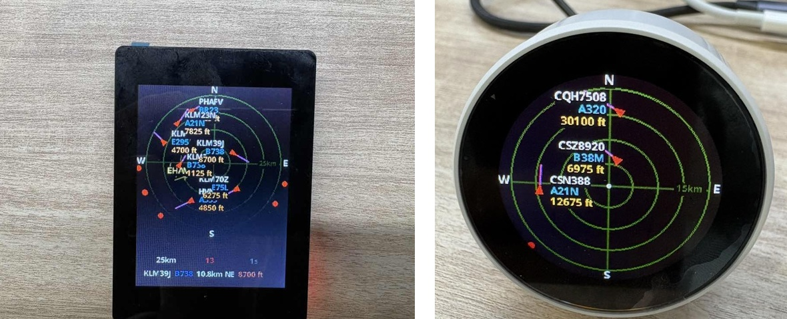
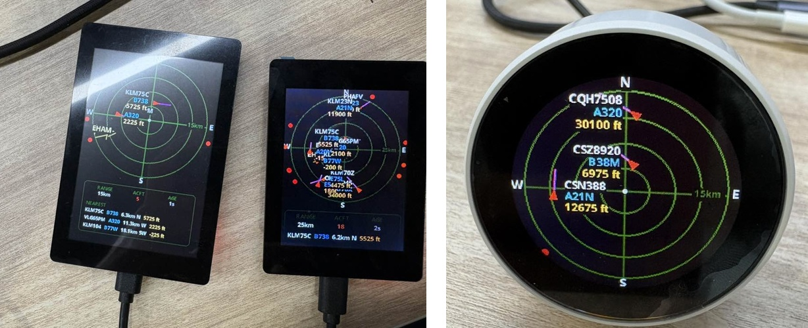

# OpenNextion ESP32 Plane Radar

[](./README.md)
[](./README.zh-CN.md)

<p align="center">
  
  <br>
  <sub>Left: ONX3248G035 / ONX2432G028 rectangular &nbsp;|&nbsp; Right: ONX2424G013 round</sub>
</p>

OpenNextion ESP32 Plane Radar is a ready-to-flash desktop aircraft radar for
OpenNextion ESP32-S3 displays — both rectangular and round. It is based on the
excellent [ESP32 Plane Radar](https://github.com/MatixYo/ESP32-Plane-Radar)
project and adds OpenNextion board support, display-optimised UI layouts, Wi-Fi
setup, and release binaries for supported OpenNextion displays.

Use it to place a small ESP32 ADS-B radar display on your desk, configure your
location through Wi-Fi setup, and watch nearby aircraft on a compact radar UI.

## Supported Displays

The public `v0.1.0` release targets three OpenNextion displays:

| Display model | Size | Resolution | Shape | Orientation | PlatformIO env | Status |
| --- | --- | --- | --- | --- | --- | --- |
| [ONX3248G035][onx3248g035] | 3.5 inch | 320 x 480 | Rectangle | Portrait | `onx3248g035` | Verified |
| [ONX2432G028][onx2432g028] | 2.8 inch | 240 x 320 | Rectangle | Portrait | `onx2432g028` | Verified |
| [ONX2424G013][onx2424g013] | 1.28 inch | 240 x 240 | Round | — | `onx2424g013` | Verified |

Do not flash firmware built for one display model onto the other display model.

## Background

I found an excellent aircraft radar project on GitHub called
[ESP32 Plane Radar](https://github.com/MatixYo/ESP32-Plane-Radar). The original
project is mainly designed for a round display, which makes the 1.28 inch
ONX2424G013 round display a natural fit. I also ported the radar UI to the
rectangular OpenNextion displays I have on hand, adapting the layout for
portrait rectangular screens.

The OpenNextion boards use ESP32-S3 as the main controller and provide useful
hardware resources for DIY projects, including schematics, board files, and
mechanical reference files for enclosure or stand design.

This fork keeps the original radar behavior and adds the OpenNextion-specific
hardware support needed by the supported boards.

## 3D Printed Enclosure

I also designed simple 3D printed enclosures for the supported OpenNextion
display sizes and will publish them on MakerWorld. Anyone who needs them can
download and print them for free.

Each enclosure is intended to be a simple desktop shell for the matching
OpenNextion display. Peel off the tape around the edge of the matching display,
then press the display into the printed enclosure and use the adhesive edge to
hold it in place.

The ONX2424G013 round display has a built-in knob form factor and does not need
a separate 3D printed enclosure.

MakerWorld project links:

- 3.5 inch ONX3248G035 enclosure: link to be added
- 2.8 inch ONX2432G028 enclosure: link to be added

## What It Shows

The radar UI keeps the original circular aircraft radar as the main visual
focus and adapts it for portrait rectangular OpenNextion displays.

- Nearby aircraft plotted around your configured latitude and longitude
- Range rings with 5 km, 10 km, 15 km, and 25 km presets
- Callsign, aircraft type, altitude, and heading indicators where available
- Aircraft outside the active radar range shown as bearing dots near the rim
- A compact information panel with range, aircraft count, update age, and nearest aircraft details
- Optional major-airport runway overlay from embedded OurAirports data

The 2.8 inch and 3.5 inch layouts are tuned separately so the radar remains the
primary UI element on both display sizes.

## Basic Usage

### First-Time Wi-Fi Setup

First-time setup starts a captive portal on the AP `PlaneRadar-Setup`.

1. Connect your phone or computer to `PlaneRadar-Setup`.
2. Open `http://plane-radar.local` or `http://192.168.4.1`.
3. Enter your home Wi-Fi credentials.
4. Enter your latitude and longitude for the radar center.
5. Save and wait for the device to reboot into the radar screen.

After the device joins your LAN, the same setup page remains available at
`http://plane-radar.local` or the device IP address printed in the serial log.
You can use it to update Wi-Fi, radar location, units, and runway overlay
settings.

### BOOT Button

Plane Radar uses the BOOT button for quick device actions. On the round
ONX2424G013, the **knob encoder can also be pressed** — it behaves exactly like
the BOOT button, so you can control everything from the front-facing knob
without ever touching the PCB.

| Action | Effect |
| --- | --- |
| Short tap | Cycle range preset: 5 -> 10 -> 15 -> 25 km; saved to flash |
| Hold 3 s | Clear Wi-Fi, location, and units; reboot into setup portal |
| Hold during setup / boot | Force credential reset and setup portal |

BOOT is GPIO `0` on all OpenNextion ESP32-S3 targets. The knob press (KEY) is
GPIO `9` on ONX2424G013.

## Firmware Download and Flashing

Download firmware from the GitHub Releases page. The `v0.1.0` release provides
one merged full-flash binary per supported display model:

| Display model | Shape | Firmware file | Flash address |
| --- | --- | --- | --- |
| [ONX3248G035][onx3248g035] | Rectangle | `opennextion-esp32-plane-radar-v0.1.0-onx3248g035.bin` | `0x0` |
| [ONX2432G028][onx2432g028] | Rectangle | `opennextion-esp32-plane-radar-v0.1.0-onx2432g028.bin` | `0x0` |
| [ONX2424G013][onx2424g013] | Round | `opennextion-esp32-plane-radar-v0.1.0-onx2424g013.bin` | `0x0` |

Flash the matching merged binary at address `0x0`:

```sh
python -m esptool --chip esp32s3 -p /dev/cu.wchusbserial1110 -b 921600 write_flash \
  0x0 ./opennextion-esp32-plane-radar-v0.1.0-onx3248g035.bin
```

Replace the serial port and firmware filename for your board.

For this release, full firmware flashing is recommended. OTA firmware downloads
are not provided unless the OTA flow is separately validated.

## Current Porting Work

This version is based on ESP32 Plane Radar and focuses on OpenNextion board
support for the three verified displays.

Main changes in this fork:

- Dedicated PlatformIO board targets for ONX3248G035, ONX2432G028, and ONX2424G013
- Board-specific LovyanGFX panel configuration for the supported displays
- Portrait rectangular radar layouts for 3.5 inch and 2.8 inch screens
- Circular radar UI for the 1.28 inch round display (ONX2424G013)
- Compact bottom information panel for rectangular display space
- BOOT button range switching and configuration reset behaviour
- Knob encoder press (KEY) as a secondary control on ONX2424G013
- Merged firmware generation for simple full flashing from address `0x0`

Touch and SD card hardware are present on the OpenNextion boards, but this
firmware does not use them yet.

## Current Validation Status

### Display Validation

<p align="center">
  
</p>

- ONX3248G035 has been validated on real hardware
- ONX2432G028 has been validated on real hardware
- ONX2424G013 has been validated on real hardware
- Wi-Fi setup flow has been validated on all OpenNextion targets
- Radar display and ADS-B refresh have been validated visually on hardware
- BOOT short tap range switching and long-press reset are supported on all boards
- Knob press (KEY) short tap and long-press are supported on ONX2424G013
- Touch and SD card are not used by this firmware yet

### Firmware Validation Matrix

Legend: ✅ Verified / ⚠️ Partially verified or hardware-dependent / ⏳ Not used

| Board | Build | Boot | Display | Wi-Fi setup | Radar UI | Touch | SD card | Notes |
| --- | --- | --- | --- | --- | --- | --- | --- | --- |
| ONX3248G035 | ✅ Verified | ✅ Verified | ✅ Verified | ✅ Verified | ✅ Verified | ⏳ Not used | ⏳ Not used | 3.5 inch ST7796U display |
| ONX2432G028 | ✅ Verified | ✅ Verified | ✅ Verified | ✅ Verified | ✅ Verified | ⏳ Not used | ⏳ Not used | 2.8 inch ST7789 display |
| ONX2424G013 | ✅ Verified | ✅ Verified | ✅ Verified | ✅ Verified | ✅ Verified | ⏳ Not used | ⏳ Not used | 1.28 inch GC9A01N round, knob encoder |

## Documentation

- [Build, Flash, and Merge Firmware](docs/BUILD_AND_FLASH.md)

## Roadmap

Planned next steps:

- Keep this OpenNextion fork aligned with upstream ESP32 Plane Radar where practical
- Add enclosure links when OpenNextion printable cases are ready
- Continue validating display, Wi-Fi, ADS-B, and UI behavior on supported hardware
- Evaluate future use of the onboard touch and SD card hardware

## Credits

This project is based on ESP32 Plane Radar. Thanks to the original author and the
related open source projects.

- ESP32 Plane Radar: https://github.com/MatixYo/ESP32-Plane-Radar
- OpenNextion open source projects: https://github.com/OpenNextion
- OpenNextion board documentation: https://nextion.tech/wiki/

## License

This project preserves the upstream ESP32 Plane Radar license terms. See
`LICENSE` for details. Third-party libraries may have their own license notices.

## Disclaimer

This project is not the official upstream ESP32 Plane Radar project.

Plane Radar displays aircraft data from public ADS-B sources and depends on
network availability, DNS, Wi-Fi quality, local configuration, and third-party
service availability. Flashing and using third-party firmware involves risk.
Please use it only after understanding the risks. This project is not
responsible for device damage, data loss, network connection issues, inaccurate
or delayed aircraft data, legal consequences, or any other consequences of use.

[onx3248g035]: https://nextion.tech/wiki/onx3248g035/
[onx2432g028]: https://nextion.tech/wiki/onx2432g028/
[onx2424g013]: https://nextion.tech/wiki/onx2424g013/
