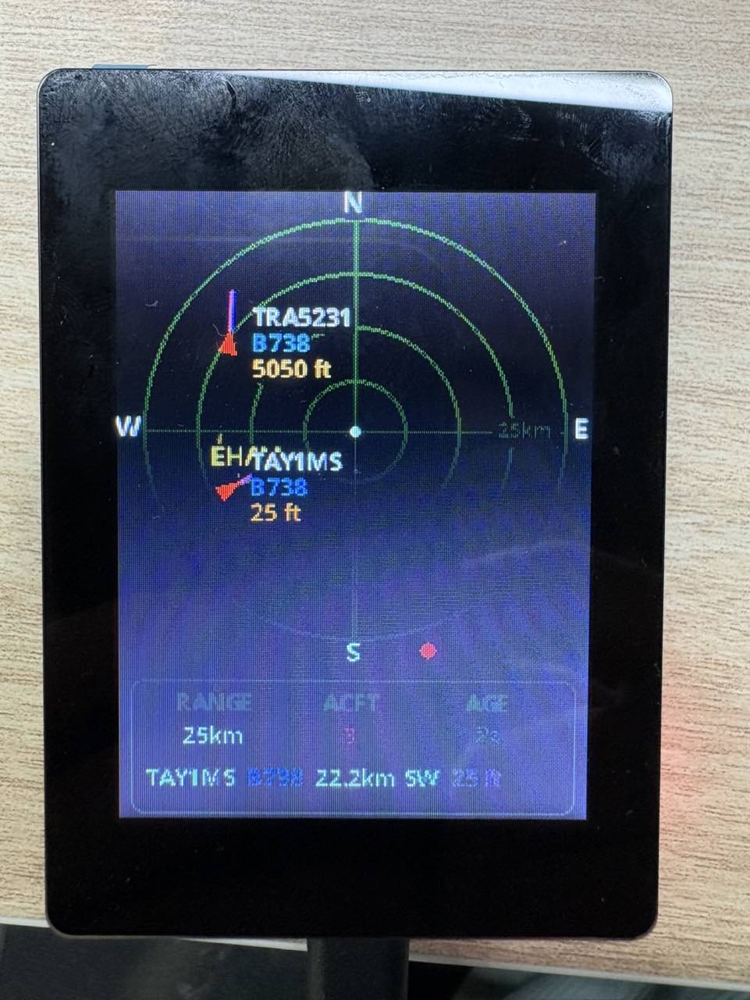
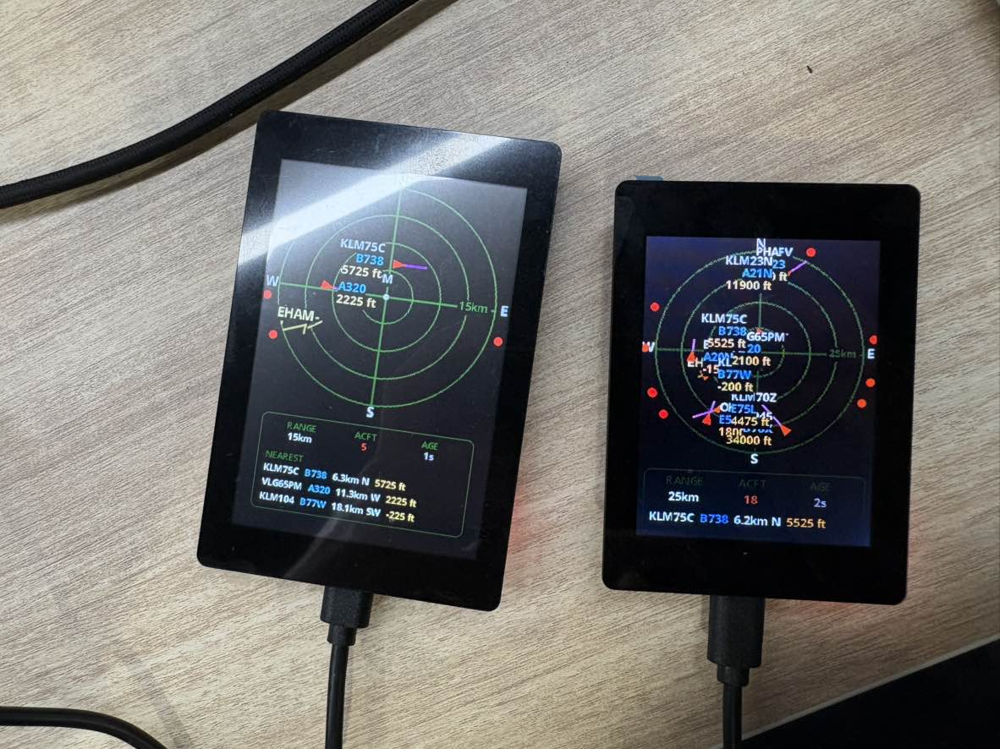

# OpenNextion ESP32 Plane Radar

[](./README.md)
[](./README.zh-CN.md)

<p align="center">
  
</p>

OpenNextion ESP32 Plane Radar 是 [ESP32 Plane Radar](https://github.com/MatixYo/ESP32-Plane-Radar) 的 OpenNextion 开发板适配分支。它为 OpenNextion ESP32-S3 矩形屏开发板增加了可直接构建的 PlatformIO 固件目标，同时保留原项目的圆形 ADS-B 雷达 UI 和首次 Wi-Fi 配网流程。

这个仓库的目标，是让 ESP32 Plane Radar 可以更容易地在已支持的 OpenNextion 开发板上构建、刷写和验证，同时等待上游板级支持 PR 审核。

## 支持的显示屏

当前公开分支重点支持两款 OpenNextion 竖屏显示屏：

| PlatformIO env | 显示屏型号 | 尺寸 | 分辨率 | 方向 | 状态 |
| --- | --- | --- | --- | --- | --- |
| `onx3248g035` | [ONX3248G035][onx3248g035] | 3.5 英寸 | 320 x 480 | 竖屏 | 已验证 |
| `onx2432g028` | [ONX2432G028][onx2432g028] | 2.8 英寸 | 240 x 320 | 竖屏 | 已验证 |

本文档主要面向 OpenNextion 开发板。源码中仍保留上游硬件目标，以保持兼容性。

构建时需要明确指定开发板目标：

```sh
pio run -e onx3248g035
pio run -e onx2432g028
```

请不要把为某一款显示屏构建的固件刷写到另一款显示屏上。

## 按键控制

Plane Radar 使用一个低电平有效的 BOOT 按键执行设备操作。

| 操作 | 效果 |
| --- | --- |
| 短按 | 切换量程：5 -> 10 -> 15 -> 25 km，并保存到 flash |
| 长按 3 秒 | 清除 Wi-Fi、位置和单位设置；重启进入配网页面 |
| 配网 / 启动时长按 | 强制清除凭据并进入配网页面 |

在 OpenNextion ESP32-S3 目标上，BOOT 按键使用 GPIO `0`。

## Wi-Fi 配网页面

首次启动会创建名为 `PlaneRadar-Setup` 的 AP 并打开配网页面。

1. 连接到 `PlaneRadar-Setup`。
2. 打开 `http://plane-radar.local` 或 `http://192.168.4.1`。
3. 设置家庭 Wi-Fi 并保存。

设备加入局域网后，同一个配置页面仍可通过 `http://plane-radar.local` 或串口日志中显示的设备 IP 地址访问。你可以在这里更新 Wi-Fi、雷达位置、单位和跑道叠加显示设置。

存储在 NVS 中的自定义字段：

| 字段 | 用途 |
| --- | --- |
| Latitude / Longitude | 雷达中心点和 ADS-B 查询位置 |
| Display distances in miles | 使用英里显示距离环标签 |
| Show airport runways | 开关主要机场跑道叠加层 |

重置后，设备会立即重启并显示配网页面，避免反复尝试失效的旧凭据。

## 背景

我发现了一个很优秀的飞机雷达项目：[ESP32 Plane Radar](https://github.com/MatixYo/ESP32-Plane-Radar)。原项目主要面向圆形屏幕设计，但我手上只有几块矩形的 OpenNextion ESP32 显示屏，所以决定把 Plane Radar 移植到这些矩形屏幕上。

OpenNextion 开发板使用 ESP32-S3 作为主控制器，并为 DIY 项目提供了实用的硬件资源，包括原理图、板级文件，以及用于外壳或支架设计的机械参考文件。

这个分支保留原始雷达行为，并增加已支持 OpenNextion 开发板所需的硬件适配。

## 3D 打印外壳

我也为已支持的 OpenNextion 显示屏尺寸设计了简单的 3D 打印外壳，并计划发布到 MakerWorld。需要的人可以免费下载和打印。

每个外壳都是为对应 OpenNextion 显示屏准备的简易桌面外壳。撕下显示屏边缘的胶带，将显示屏压入打印外壳中，并用边缘胶固定到位。

MakerWorld 项目链接：

- 3.5 英寸 ONX3248G035 外壳：待补充
- 2.8 英寸 ONX2432G028 外壳：待补充

## 当前移植工作

这个版本基于 ESP32 Plane Radar，并增加 OpenNextion 多开发板支持。主要改动包括：

### 1. OpenNextion 开发板支持

OpenNextion ESP32 Plane Radar 为以下开发板提供独立 PlatformIO 环境：

- [ONX3248G035][onx3248g035] 3.5 英寸竖屏显示屏
- [ONX2432G028][onx2432g028] 2.8 英寸竖屏显示屏

每个开发板都有自己的 PlatformIO board JSON 文件和板级宏：`BOARD_ONX3248G035` 或 `BOARD_ONX2432G028`。

### 2. 显示屏和板级初始化

本移植增加了已支持开发板所需的 OpenNextion 显示初始化：

- ONX3248G035 的 ST7796U SPI TFT 面板支持
- ONX2432G028 的 ST7789 SPI TFT 面板支持
- 用于 LCD reset 和释放 SDCS 的 PCF8574 IO 扩展器支持
- 背光 GPIO 设置
- 板级 LovyanGFX 面板选择

板级引脚映射由 PlatformIO board 目标和 `include/config.h` 处理。

OpenNextion 开发板带有触摸和 SD 卡硬件，但当前固件尚未使用它们。

### 3. 矩形屏 UI 布局

原项目使用 240 x 240 圆形雷达。OpenNextion 开发板使用竖向矩形屏，所以雷达保留在屏幕上方，并在下方增加信息面板。

当前布局行为：

- ONX2432G028：顶部 240 x 240 雷达，下方紧凑信息面板
- ONX3248G035：顶部更大的 320 x 320 雷达，下方更大的信息面板
- 上游兼容目标：保持原始 240 x 240 雷达 UI

信息面板会根据屏幕空间显示量程、飞机数量、更新时间和最近飞机信息。

### 4. 3.5 英寸显示屏的 PSRAM Frame Sprite

ONX3248G035 使用 320 x 480 全屏 frame sprite。该开发板会把 frame sprite 分配到 PSRAM，以避免内存分配失败和屏幕闪烁。

### 5. PlatformIO 构建和合并目标

项目包含所有支持目标的 PlatformIO 环境，并使用 `pio run -t merge` 或辅助脚本生成可从地址 `0x0` 完整刷写的单个合并固件。

## 当前验证状态

### 显示验证

<p align="center">
  
</p>

- ONX3248G035 已在真实硬件上验证
- ONX2432G028 已在真实硬件上验证
- Wi-Fi 配网流程已在 OpenNextion 目标上验证
- 雷达显示和 ADS-B 刷新已在硬件上进行视觉验证
- BOOT 短按切换量程和长按重置已支持
- 当前固件尚未使用触摸和 SD 卡

### 固件验证矩阵

图例：✅ 已验证 / ⚠️ 部分验证或依赖硬件环境 / ⏳ 未使用

| 开发板 | 构建 | 启动 | 显示 | Wi-Fi 配网 | 雷达 UI | 触摸 | SD 卡 | 备注 |
| --- | --- | --- | --- | --- | --- | --- | --- | --- |
| ONX3248G035 | ✅ 已验证 | ✅ 已验证 | ✅ 已验证 | ✅ 已验证 | ✅ 已验证 | ⏳ 未使用 | ⏳ 未使用 | 3.5 英寸 ST7796U 显示屏 |
| ONX2432G028 | ✅ 已验证 | ✅ 已验证 | ✅ 已验证 | ✅ 已验证 | ✅ 已验证 | ⏳ 未使用 | ⏳ 未使用 | 2.8 英寸 ST7789 显示屏 |

## 雷达功能

### 网格和量程

- 深蓝背景，绿色距离环和十字线
- 白色 N / S / E / W 方位标签，以及东侧量程标签
- 量程预设：5 km、10 km、15 km、25 km
- 可以在配网页面选择英里或公里

量程预设存储在 NVS 中，并在 `include/ui/radar_range.h` 中配置。

### 飞机

- 外圈内的飞机使用红色航向三角形显示
- 紫色速度向量显示航迹方向
- 每架飞机旁边显示呼号、机型和高度标签
- 外圈外的飞机以红色方位点显示在屏幕边缘

### 跑道

- 主要机场数据由 OurAirports 的 `large_airport` 数据生成
- 启用后，开放跑道以青绿色显示
- 配网页面可启用或关闭跑道叠加层
- 可使用 `python3 scripts/build_large_airports.py` 重新生成嵌入列表

### ADS-B 数据

- 数据源：`https://opendata.adsb.fi/api/v3/`
- 请求半径由当前雷达量程决定
- 轮询间隔由 `include/config.h` 中的 `kAdsbFetchIntervalMs` 控制
- 默认通过 `kAdsbShowGroundAircraft` 隐藏地面飞机

## 固件下载和刷写

当 release 固件可用时，请从 GitHub Release 页面下载。合并固件适合从地址 `0x0` 进行完整首次刷写。

Release 文件遵循以下命名规则：

```text
opennextion-esp32-plane-radar-<version>-<target>.bin
```

| Target | 示例固件文件 | 刷写地址 |
| --- | --- | --- |
| `onx3248g035` | `opennextion-esp32-plane-radar-v0.1.0-onx3248g035.bin` | `0x0` |
| `onx2432g028` | `opennextion-esp32-plane-radar-v0.1.0-onx2432g028.bin` | `0x0` |

刷写合并固件：

```sh
VERSION=v0.1.0
python -m esptool --chip esp32s3 -p /dev/cu.wchusbserial1110 -b 921600 write_flash \
  0x0 ./opennextion-esp32-plane-radar-${VERSION}-onx2432g028.bin
```

请根据你的开发板替换 `VERSION`、串口和固件目标名称。

对于本项目，首次安装推荐使用完整固件刷写。除非 OTA 流程单独验证，否则不提供 OTA 固件下载。

## 本地构建、刷写和串口监视

本项目使用 PlatformIO 和 Arduino framework。下面的命令面向 OpenNextion 开发板。

### 构建

```bash
pio run -e onx2432g028
pio run -e onx3248g035
```

### 清理并重新构建

```bash
pio run -e onx2432g028 -t clean
pio run -e onx3248g035 -t clean
```

更深度清理时，可以删除指定开发板的构建和依赖目录：

```bash
rm -rf .pio/build/onx2432g028 .pio/libdeps/onx2432g028
rm -rf .pio/build/onx3248g035 .pio/libdeps/onx3248g035
```

### 上传

```bash
pio run -e onx2432g028 -t upload --upload-port <PORT>
pio run -e onx3248g035 -t upload --upload-port <PORT>
```

macOS 上 OpenNextion 常见串口示例：

```bash
pio run -e onx3248g035 -t upload --upload-port /dev/cu.wchusbserial1110
```

### 查看串口日志

```bash
pio device monitor -e <env> --port <PORT> --baud 115200
```

固件连接 Wi-Fi 后会打印局域网配置 URL，例如 `http://plane-radar.local` 或 `http://<device-ip>`。

### 生成单个合并固件

PlatformIO merge 目标：

```bash
pio run -e onx2432g028 -t merge
pio run -e onx3248g035 -t merge
```

输出文件：

```text
.pio/build/<env>/firmware-merged.bin
```

辅助脚本：

```bash
VERSION=v0.1.0
chmod +x scripts/merge-firmware.sh
./scripts/merge-firmware.sh --env onx2432g028 -o release/opennextion-esp32-plane-radar-${VERSION}-onx2432g028.bin
./scripts/merge-firmware.sh --env onx3248g035 -o release/opennextion-esp32-plane-radar-${VERSION}-onx3248g035.bin
```

如果固件已经构建完成，可以跳过重新构建：

```bash
VERSION=v0.1.0
./scripts/merge-firmware.sh --env onx3248g035 --no-build -o release/opennextion-esp32-plane-radar-${VERSION}-onx3248g035.bin
```

## 依赖

- [LovyanGFX](https://github.com/lovyan03/LovyanGFX)
- [WiFiManager](https://github.com/tzapu/WiFiManager)
- [ArduinoJson](https://github.com/bblanchon/ArduinoJson)
- [adsb.fi Open Data API](https://opendata.adsb.fi/)

## 路线图

后续计划：

- 在可行情况下，让这个 OpenNextion 分支持续跟进上游 ESP32 Plane Radar
- 在 GitHub Releases 中发布方便刷写的合并固件
- OpenNextion 可打印外壳准备好后补充链接
- 继续在已支持硬件上验证显示、Wi-Fi、ADS-B 和 UI 行为

## 致谢

本项目基于 ESP32 Plane Radar。感谢原作者和相关开源项目。

- ESP32 Plane Radar: https://github.com/MatixYo/ESP32-Plane-Radar
- OpenNextion open source projects: https://github.com/OpenNextion
- OpenNextion board documentation: https://nextion.tech/wiki/

## 许可证

本项目保留上游 ESP32 Plane Radar 的许可证条款。详情见 `LICENSE`。第三方库可能有各自的许可证声明。

## 免责声明

本项目不是官方上游 ESP32 Plane Radar 项目。

Plane Radar 显示来自公开 ADS-B 来源的飞机数据，并依赖网络可用性、DNS、Wi-Fi 质量、本地配置和第三方服务可用性。刷写和使用第三方固件存在风险。请在理解风险后使用。本项目不对设备损坏、数据丢失、网络连接问题、不准确或延迟的飞机数据、法律后果或其他任何使用后果负责。

[onx3248g035]: https://nextion.tech/wiki/onx3248g035/
[onx2432g028]: https://nextion.tech/wiki/onx2432g028/
